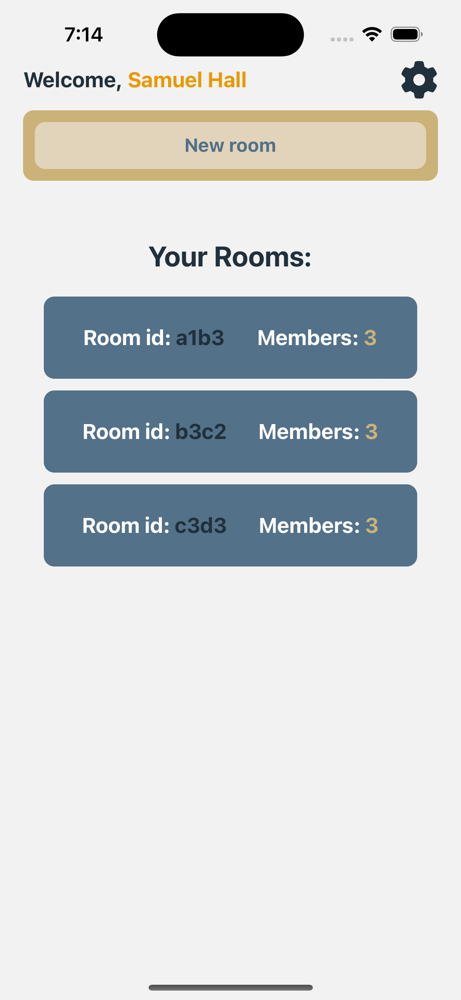

## ✨ CollabConnect ✨ *Connecting Minds, Inspiring Futures*.

>  Welcome to ✨CollabConnect ✨, your gateway to a new era of education. We bring teachers and students together in a virtual space that's all about seamless communication and collaboration.

>>  Imagine classrooms without walls, where learning happens anytime, anywhere. With ✨CollabConnect ✨, teachers create *Rooms* that host two types of chats. In the *Student Chat*, students exchange ideas and questions. In the *Teacher-Student Chat*, mentors guide discussions to deeper insights.

>>  But it doesn't stop there. We've also integrated a *Tasks* feature that turns assignments into team efforts. Think of it as a digital workspace, like what you find on GitHub, where everyone contributes to shared goals.

>>  Join us and experience education without boundaries. ✨CollabConnect ✨ isn't just an app; it's a community where minds meet, ideas flourish, and learning knows no limits

---

### Authentication

>As a teacher or student, your journey begins at the authentication screen where you can log in. Our app focuses on seamless login functionality, tailored to the accounts created by your educational institution. While currently supporting login exclusively, we envision future possibilities, including registration for aspiring tutors. Join us in shaping the future of collaborative learning.

  
  

---

### Home

>The homepage greets teachers and students with special *Rooms.* Created by teachers, these spaces make connecting and learning effortless. They bring teachers and students together in a harmonious online setting, making education more accessible and enjoyable

  
  
  

>Unlock the Power of Collaboration: Teachers can seamlessly create interactive *Rooms* for themselves and their students. Meanwhile, students can effortlessly join any room using its unique ID, eliminating the need for teacher approval. For those not yet in a room, an engaging animation awaits, setting the stage for your educational journey

---

### Creating rooms

>Elevate Classroom Connectivity: Teachers have the authority to forge *Rooms* by inputting student emails. With an auto-generated room ID, initiation is simplified. Seamless communication and engagement await, fostering an environment where learning knows no bounds.

  
  

---

### Chat room

>Each room in ✨CollabConnect ✨has two channels designed to enhance learning. The first is just for students, offering a private space for peer interactions. The second channel is for both teachers and students, encouraging dynamic discussions guided by educators. Plus, we prioritize privacy – the *Students Only* room is exclusively accessible to students, ensuring a secure environment for open communication and collaboration

  
  

---

### Task room

> Delving deeper into CollabConnect's versatile features, every room houses an invaluable *Tasks* page. This page is tailor-made to equip teachers with a comprehensive view of the group*s collective progress. As an essential hub for tracking advancements, the *Tasks* page becomes a focal point for educators to witness firsthand how students are journeying toward their objectives.

  
  
  

> #### Empowered by React Native and Firebase, our application comes to life. Seamlessly crafted to provide a cutting-edge user experience, React Native forms the foundation. Firebase, our trusted partner, stores user data securely while enabling real-time updates for rooms, messages, and tasks through a dynamic real-time database. Every user benefits from instant data synchronization, ensuring a fluid and responsive learning environment.

---

> If you want to see the **Byte Masters Hackathon** presentation click [here](https://docs.google.com/presentation/d/1xtpCc3sbzOxWwS0Iofg_6N2on7XzubgDgcyJ477ebIY/edit?usp=sharing).